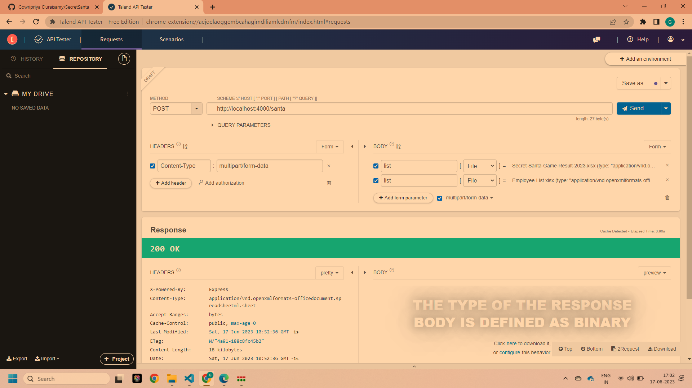

# Secret-Santa

SecretSanta used to assign secret child to the employees to provide the gift from one employee to other.

# Getting Started
# Installation 

Clone the repo and install the dependencies.

git clone https://github.com/Gowripriya-Duraisamy/SecretSanta.git
yarn install

# Constraints

1. Excel Data should be in proper format and data should be clean.
2. Number of records should be minimum of 3.

# Executing Program

To start the express server, run the following **yarn startDev** 
Server starts listening in the port 4000

# ScreenShots

Screen shot Sample to hit the santa api from TalendApi tester to get the automated list to gift the employees. Click here to download button will download the file. Upload the all files with the name as *list*

# Code Explanation

Secret Santa logic starts from the folder **src/controllers/santa.ts**
Added comments in the code for line by line explanation inside the function.

# Business Logic
1. Loop the employee list, to assign the secret child
2. While looping, when one employee is selected to assign the Secret child. Furthermore, secret child is also present in the employee email list 

    Since secret child assigning has few conditions:
      1. An employee cannot choose themselves as their secret child.
      • An employee cannot be assigned to the same secret child as in the previous 
year's Secret Santa event, if applicable.
      • Each employee must have exactly one secret child.
      • Each secret child should be assigned to only one employee.

    To select secret child,
    > For condition 1, loop the employee email list from backwards.
    > For condition 2, fetch the already assigned secret child for that employee.
    
    Iterating backwards in employee email list, 
    if selected employee from backward does meet the conditions, assign it as secret child for employee. Else, iterate until it satisfies.
    Once secret child is assigned, remove it from employee email list.

    Continue the loop till all employees assigned. In this way, remaining conditions also satisfied
                 

## Functions list
*fileConv* - Convert the given file into json object using xlsx npm package
*ConstructOutputExcel* - Business logic added to assign the employee to gift and obtained the json object
*ConstructXLSXFile* - Generate the file with constructed json object.

